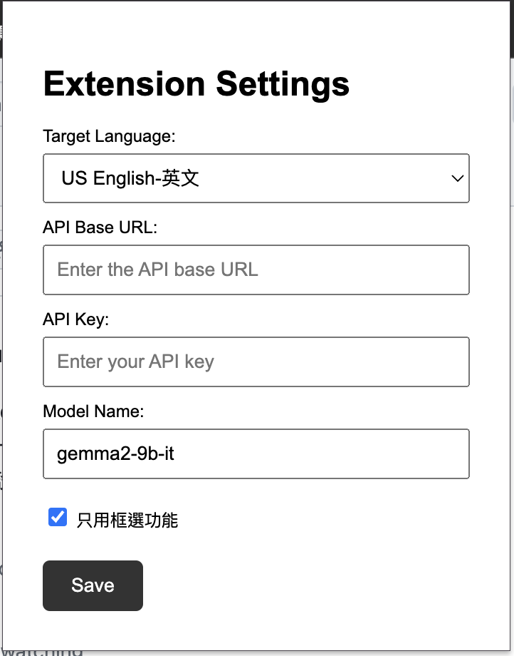

# Onekey-Translator

Onekey-Translator 是一個瀏覽器擴展，用於一鍵翻譯選取的文字並替換，並支援多種設定功能，包括翻譯目標語言、API Base URL 和 API Key 的設定。


## 功能

- 一鍵翻譯選取的文字
- 設置翻譯目標語言
- 設置 API Base URL 和 API Key
- 選擇是否只使用框選功能
- 翻譯結果複製到剪貼簿並顯示 Toast 消息

## 安裝

1. 克隆此存儲庫到本地：
   ```bash
   git clone https://github.com/jakevin/onekey-translator.git
   ```

2.	打開瀏覽器並進入擴展管理頁面：
•	對於 Chrome：打開 chrome://extensions/
•	對於 Firefox：打開 about:addons
3.	開啟「開發者模式」（Chrome）或「開發者工具」（Firefox）。
4.	點擊「加載已解壓的擴展程序」（Chrome）或「臨時加載附加組件」（Firefox），然後選擇克隆的專案目錄。

## 使用



1.	點擊瀏覽器工具欄中的擴展圖標，進入設定頁面。
2.	在設定頁面中，選擇翻譯目標語言、輸入 API Base URL 和 API Key，並選擇是否只使用框選功能。然後點擊「保存」。
3.	設置完成後，選取網頁上的文字，將顯示一個「翻譯」按鈕。點擊該按鈕後，文字將被翻譯並替換，翻譯結果將自動複製到剪貼簿，並顯示 Toast 消息。