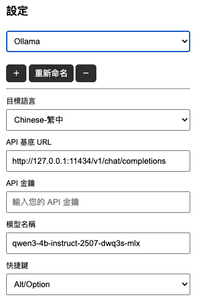
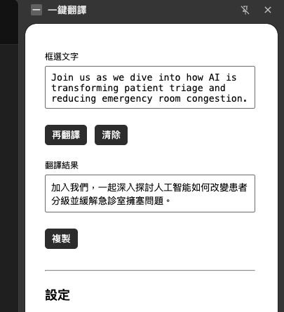
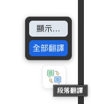
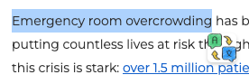
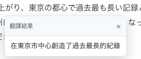

# Onekey-Translator

Onekey-Translator 是一個瀏覽器擴展，用於一鍵翻譯選取的文字並替換，並支援多種設定功能，包括翻譯目標語言、API Base URL 和 API Key 的設定。


圖文說明請看：https://jakevin.medium.com/%E4%B8%80%E9%8D%B5%E7%BF%BB%E8%AD%AF-%E7%B6%B2%E9%A0%81%E7%BF%BB%E8%AD%AF%E7%9A%84%E6%96%B0%E5%88%A9%E5%99%A8-d22010bbb5a3

## 功能

- 一鍵翻譯選取的文字（支援雙擊、三擊選取顯示按鈕）
- 設定翻譯目標語言、API Base URL、API Key、模型
- 設定 HotKey（預設 Alt/Option）與段落按鍵顯示門檻（字數）
- 段落翻譯：在段落末尾顯示「…」按鈕，點擊即可插入譯文；支援「全部翻譯」可自動處理視窗內可見段落
- 選擇是否只使用框選功能
- 設定頁可一鍵複製翻譯結果到剪貼簿，並顯示 Toast 提示

## 使用方式

支援各種相容於OpenAI的API，LM studio與Ollama自然也可以使用
qwen3-4b-instruct-2507-dwq3s-mlx 日常使用非常推薦！

1.	點擊瀏覽器工具欄中的擴展圖標，進入設定頁。



2.	在設定頁中，選擇翻譯目標語言、輸入 API Base URL 和 API Key、選擇模型，並可設定 HotKey 與「段落按鍵門檻」。然後點擊「保存」。

3. 臨時輸入框翻譯



4. 全文自動翻譯




5. 彈窗翻譯






## 安裝

直接到商店下載：https://chromewebstore.google.com/detail/onekey-translator/gobdpcobbgbcmbojhpdonhhfogpicahd?authuser=0&hl=zh-TW

1. 克隆此存儲庫到本地：
   ```bash
   git clone https://github.com/jakevin/onekey-translator.git
   ```

2.	打開瀏覽器並進入擴展管理頁面：
•	對於 Chrome：打開 chrome://extensions/
•	對於 Firefox：打開 about:addons
3.	開啟「開發者模式」（Chrome）或「開發者工具」（Firefox）。
4.	點擊「加載已解壓的擴展程序」（Chrome）或「臨時加載附加組件」（Firefox），然後選擇克隆的專案目錄。

## HTML 顯示邏輯（安全插入）

- 自動判斷譯文是否為 HTML 片段，並決定使用 `innerHTML` 或 `textContent` 插入：
  - 當譯文包含常見標籤（如 `<b>…</b>`）、`<br>` 或 HTML 實體（如 `&nbsp;`）時，使用 `innerHTML` 呈現以保留格式。
  - 其他情況一律使用 `textContent`，確保以純文字安全插入，避免破壞原頁結構。
- 判斷邏輯已從公用工具分離，內建於 `content_script.js`，只在需要保留 HTML 格式時才啟用 `innerHTML`，降低 XSS 風險。

建議：若後端可能回傳非預期 HTML，可再加上白名單標籤或消毒策略以進一步強化安全性。
