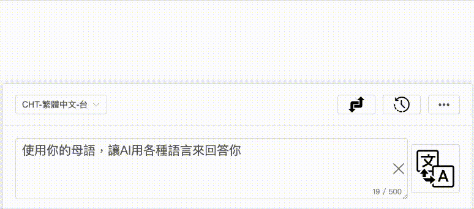

# Onekey-Translator

Onekey-Translator 是一個瀏覽器擴展，用於一鍵翻譯選取的文字並替換，並支援多種設定功能，包括翻譯目標語言、API Base URL 和 API Key 的設定。



## 功能

- 一鍵翻譯選取的文字（支援雙擊、三擊選取顯示按鈕）
- 設定翻譯目標語言、API Base URL、API Key、模型
- 設定 HotKey（預設 Alt/Option）與段落按鍵顯示門檻（字數）
- 段落翻譯：在段落末尾顯示「…」按鈕，點擊即可插入譯文；支援「全部翻譯」可自動處理視窗內可見段落
- 選擇是否只使用框選功能
- 設定頁可一鍵複製翻譯結果到剪貼簿，並顯示 Toast 提示

## 使用方式


1.	點擊瀏覽器工具欄中的擴展圖標，進入設定頁。
2.	在設定頁中，選擇翻譯目標語言、輸入 API Base URL 和 API Key、選擇模型，並可設定 HotKey 與「段落按鍵門檻」。然後點擊「保存」。
3.	在任何網頁：
   - 選取文字後，會在選區附近出現「翻譯」按鈕；點擊後顯示譯文並在設定頁面同步更新來源/結果欄位。
   - 按下 HotKey（預設 Alt/Option）可快速翻譯目前滑鼠按下位置的元素全文，譯文會以區塊方式附加在原內容後方。
   - 段落翻譯：滑鼠移到右側浮動按鈕，可開啟選單「顯示…／隱藏…」與「全部翻譯」。顯示「…」後，頁面會在符合門檻字數的段落末尾加上「…」按鈕；點擊即可把譯文插入該段落之後。啟用「全部翻譯」時，會自動翻譯視窗內的可見段落，隨捲動持續處理。

提示：設定頁提供「複製結果」按鈕，可快速將最新的譯文複製到剪貼簿。

## 安裝

1. 克隆此存儲庫到本地：
   ```bash
   git clone https://github.com/jakevin/onekey-translator.git
   ```

2.	打開瀏覽器並進入擴展管理頁面：
•	對於 Chrome：打開 chrome://extensions/
•	對於 Firefox：打開 about:addons
3.	開啟「開發者模式」（Chrome）或「開發者工具」（Firefox）。
4.	點擊「加載已解壓的擴展程序」（Chrome）或「臨時加載附加組件」（Firefox），然後選擇克隆的專案目錄。

## HTML 顯示邏輯（安全插入）

- 自動判斷譯文是否為 HTML 片段，並決定使用 `innerHTML` 或 `textContent` 插入：
  - 當譯文包含常見標籤（如 `<b>…</b>`）、`<br>` 或 HTML 實體（如 `&nbsp;`）時，使用 `innerHTML` 呈現以保留格式。
  - 其他情況一律使用 `textContent`，確保以純文字安全插入，避免破壞原頁結構。
- 判斷邏輯已從公用工具分離，內建於 `content_script.js`，只在需要保留 HTML 格式時才啟用 `innerHTML`，降低 XSS 風險。

建議：若後端可能回傳非預期 HTML，可再加上白名單標籤或消毒策略以進一步強化安全性。
